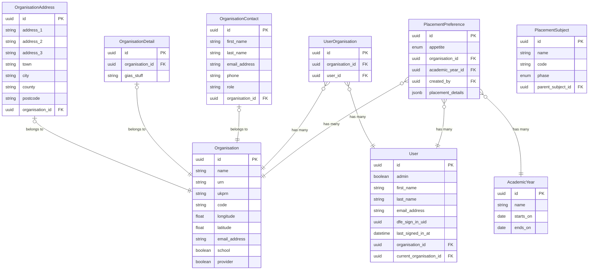

```mermaid
erDiagram
  AcademicYear {
    uuid id PK
    string name
    date starts_on
    date ends_on
  }

  User {
    uuid id PK
    boolean admin
    string first_name
    string last_name
    string email_address
    uuid dfe_sign_in_uid
    datetime last_signed_in_at
    uuid organisation_id FK
    uuid current_organisation_id FK
  }

  UserOrganisation {
    uuid id PK
    uuid organisation_id FK
    uuid user_id FK
  }

  Organisation {
    uuid id PK
    string name
    string urn
    string ukprn
    string code
    float longitude
    float latitude
    string email_address
    boolean school
    boolean provider
  }

  OrganisationDetail {
    uuid id PK
    uuid organisation_id FK
    string gias_stuff
  }

  OrganisationContact {
    uuid id PK
    string first_name
    string last_name
    string email_address
    string phone
    string role
    uuid organisation_id FK
  }

  OrganisationAddress {
    uuid id PK
    string address_1
    string address_2
    string address_3
    string town
    string city
    string county
    string postcode
    uuid organisation_id FK
  }

  PlacementPreference {
    uuid id PK
    enum appetite
    uuid organisation_id FK
    uuid academic_year_id FK
    uuid created_by FK
    jsonb placement_details
  }

  PlacementSubject {
    uuid id PK
    string name
    string code
    enum phase
    uuid parent_subject_id FK
  }

  OrganisationAddress |o--|| Organisation : "belongs to"
  OrganisationDetail |o--|| Organisation : "belongs to"
  OrganisationContact |o--|| Organisation : "belongs to"
  UserOrganisation }o -- || Organisation : "has many"
  UserOrganisation }o -- || User : "has many"
  PlacementPreference }o -- || Organisation : "has many"
  PlacementPreference }o -- || AcademicYear : "has many"
  PlacementPreference }o -- || User : "has many"
```