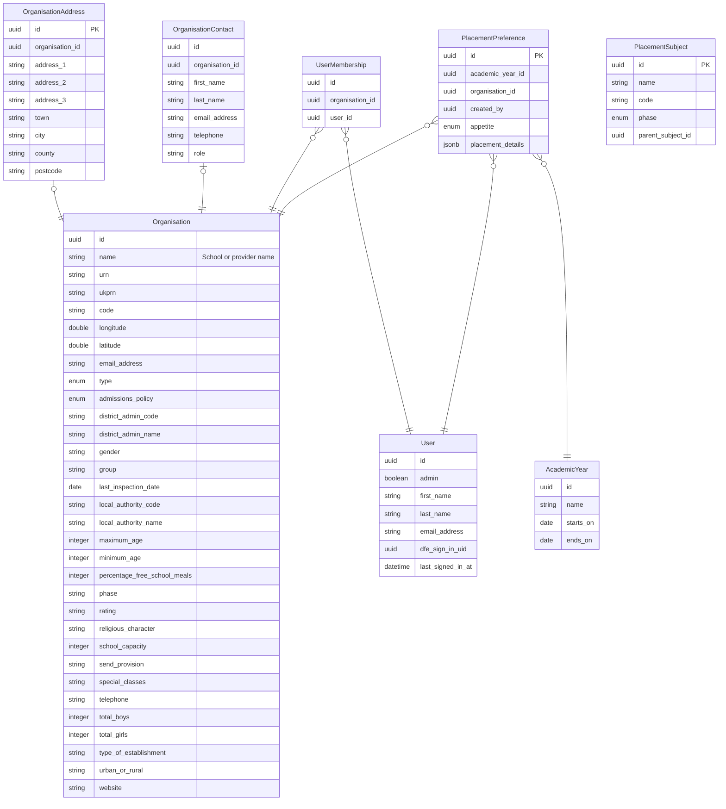

# ADR-002: Initial data model

Date: 2025-07-18

## Status

Accepted

---

## Context

This service will track school placement preferences for Initial Teacher Training (ITT). The intent is to allow schools to express their willingness and ability to host placements for trainee teachers, which we hope will facilitate more placements in the market.

To enable us to do this, we need to define a data model that captures:

- Relationships between users, schools, and ITT providers
- The school interest in hosting placements for each academic year
- Organisation details such as URN, UKPRN, addresses and contact information
- Subjects that placements can be categorised by

### Key domain concepts:

- **Users** (teachers, provider staff, school staff, DfE staff)
- **Organisations** (schools and training providers)
- **Placement Preferences** (set up by schools, expresses the willingness/ability to host placements)
- **Academic Years** (placement context)
- **Subjects** (categorisation for placements)

---

## Decision

We will create a data model using a relational database schema. Our initial model will include the following tables and relationships:

#### User

Represents a real person who can log into and interact with the service.

- Fields: `first_name`, `last_name`, `email_address`, `admin`, `dfe_sign_in_uid`, `last_signed_in_at`
- Linked to organisations via `UserOrganisation`, users may belong to multiple organisations.
- Sign in flow will be handled via DfE Sign-in API, using `dfe_sign_in_uid`
- The `admin` boolean allows for internal DfE users to be distinguished from regular users.

#### Organisation

Represents either a school or a provider via the type column, this uses Single Table Inheritance (STI).

- Fields: `urn`, `ukprn`, `code`, `longitude`, `latitude`, `email_address`, `type`, `admissions_policy`, `district_admin_code`, `district_admin_name`, `gender`, `group`, `last_inspection_date`, `local_authority_code`, `local_authority_name`, `maximum_age`, `minimum_age`, `percentage_free_school_meals`, `phase`, `rating`, `rating`, `religious_character`, `school_capacity`, `send_provision`, `special_classes`, `telephone`, `total_boys`, `total_girls`, `type_of_establishment`, `urban_or_rural` and `website`
- Longitude and latitude are used for distance based searching between schools and a specified location.
- The vast majority of these fields are sourced from Get Information About Schools (GIAS) and are only relevant for school records.

#### UserMembership

Join table that links `User` and `Organisation` to represent the many-to-many relationship between users and organisations.

- Fields: `organisation_id`, `user_id`

#### AcademicYear

Used to set the placement preferences for each year. Schools utilise academic years to define the start and end of the school year, we have chosen to use this as the basis for our placement preferences.

- Fields: `name`, `starts_on`, `ends_on`

#### PlacementPreference

Records whether and how a school is offering placements.

- Fields: `academic_year_id`, `organisation_id`, `created_by_id`, `appetite`, `placement_details`
- Has foreign keys for `organisation`, `academic_year`, and `user`
- Use of a JSONB field allows flexibility in defining the placement preferences. This is useful in the initial setup, but replacing this with a more structured model should be investigated in the future. 

#### PlacementSubject

Stores the subjects that accredited ITT providers can offer placements in.

- Fields: `name`, `code`, `phase`, `parent_subject_id`
- Phase can be either "primary" or "secondary"

#### OrganisationAddress 

Stores the postal address of an organisation, allowing for multiple addresses per organisation.

- Fields: `address_1`, `address_2`, `address_3`, `town`, `city`, `county`, `postcode`

#### OrganisationContact

Stores contact details for individuals at an organisation, such as placement coordinators.

- Fields: `organisation_id`, `first_name`, `last_name`, `email_address`

---

## Considerations

- Usage of a JSONB field in `PlacementPreference` allows for flexible data storage, but may complicate querying and validation.
- This ERB will need to be refined as we gather more requirements and feedback from users, this isn't a final data model.

---

## Next Steps

- Create migrations to instantiate the tables defined in the entity relationship diagram

---
